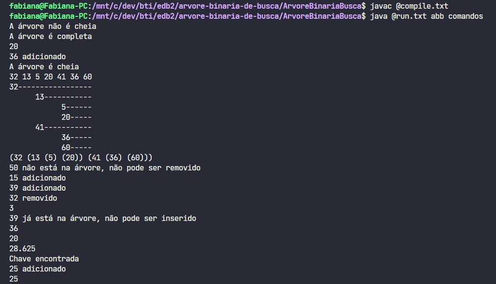

<h1 align="center"> 
	🌳 Árvore binária de busca 🔍
</h1>

<p align="center">
 <a href="#-sobre-o-projeto">Sobre</a> •
 <a href="#-funcionalidades">Funcionalidades</a> •
 <a href="#-exemplo">Exemplo</a> • 
 <a href="#-como-executar-o-projeto">Como executar</a> •
 <a href="#-autores">Autores</a>
</p>

## 💻 Sobre o projeto

Trabalho desenvolvido para a disciplina Estruturas de Dados Básicas II, cujo objetivo é implementar uma árvore binária de busca em Java.
Clique [aqui](https://docs.google.com/document/d/1VuMgOgqID095fgwAZYU5_QYHJEwqrg5w_-mbAJ7tscA/edit?usp=sharing) para acessar o documento com o relatório do trabalho.

---

## ⚙ Funcionalidades

- [x] Carregamento de arquivos de entrada
- [x] Busca de um nó com base na chave
- [x] Busca do n-ésimo elemento
- [x] Posição ocupada por um elemento
- [x] Inserção de um nó
- [x] Remoção de um nó
- [x] Mediana da árvore binária de busca
- [x] Média da árvore binária de busca
- [x] Verificar se árvore é cheia
- [x] Verificar se árvore é completa
- [x] Sequência de elementos em pré-ordem
- [x] Impressão da árvore 

---

## 📑 Exemplo

<p align="center">
  
</p>

---

## 🚀 Como executar o projeto

### Instalação

Para executar o programa, é necessário ter o JDK do Java instalado na máquina. Para instalar no Linux, execute no terminal

```bash
$ sudo apt install default-jdk
```

Após a instalação, clone este repositório

```bash

# Clone este repositório
$ git clone https://github.com/fabianapduarte/arvore-binaria-de-busca.git

# Acesse a pasta ArvoreBinariaBusca do projeto no terminal/cmd
$ cd arvore-binaria-de-busca

```

<br />

### Rodando o projeto com os arquivos presentes em `/entrada`

```bash

# Acesse a pasta ArvoreBinariaBusca do projeto no terminal/cmd
$ cd ArvoreBinariaBusca

# Compile o código
$ javac @compile.txt

# Execute o programa
$ java @run.txt abb comandos

```

<br />

### Rodando o projeto com outros arquivos de entrada

**⚠ Observações:**

- Adicione as novas bases de dados em formato `.txt` na pasta `/entrada`;
- O arquivo da árvore deve apresentar os elementos em linha única e separados por espaço em branco;
- O arquivo com os comandos da árvore devem apresentar os comandos um por linha e escritos em caixa alta;
- Ao executar o programa, **não** é necessário acrescentar as extensões dos arquivos de entrada.

```bash
# Acesse a pasta ArvoreBinariaBusca do projeto no terminal/cmd
$ cd ArvoreBinariaBusca

# Compile o código
$ javac @compile.txt

# Execute o programa com os arquivos de entrada
# Substitua <abb> pelo nome do arquivo com os elementos da árvore
# Substitua <comandos> pelo nome do arquivo que conterá os comandos a serem executados
$ java @run.txt <abb> <comandos>

```

---

## 👥 Autores

- Fabiana Pereira
- Samuel Costa
